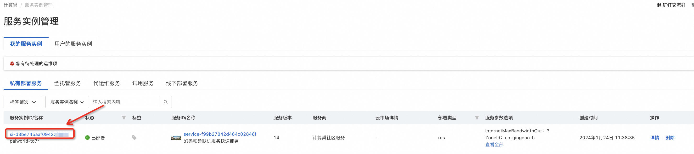
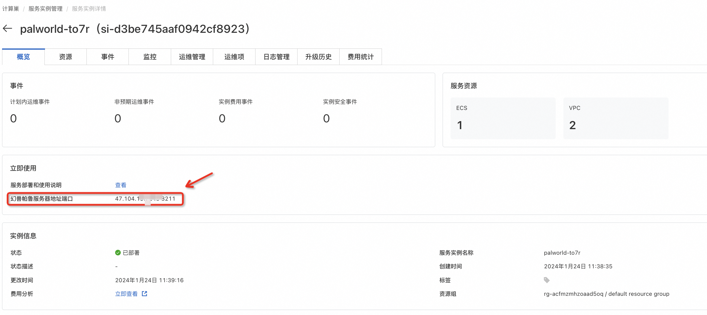
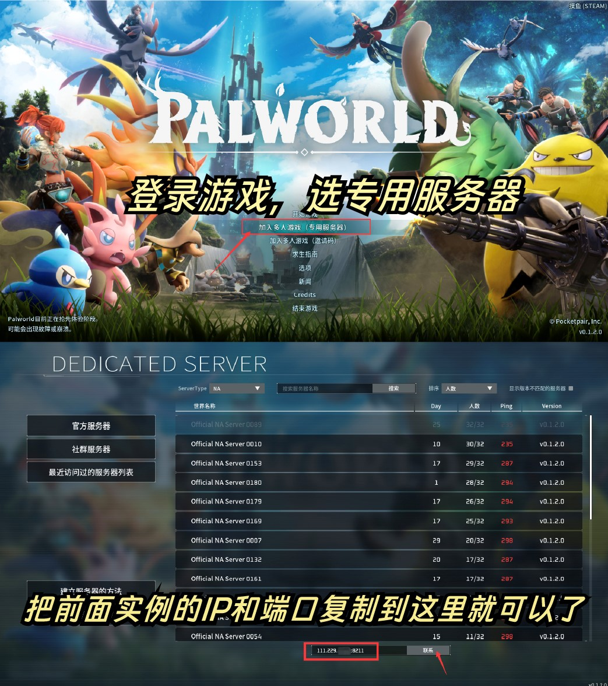

# 一招教你解决2024开年最火爆游戏《幻兽帕鲁》联机服务器如何搭建

最近，生存类游戏《幻兽帕鲁》由Pocketpair推出，火爆网络，最高在线人数已接近200万。官方服务器压力过大无法提供稳定的游戏体验，但同时游戏开发商还提供了搭建私人专用服务器的方案，让玩家可以与朋友一起联机游戏，甚至还能自定义经验翻倍等游戏选项。

那么，如何快速拥有一个可以和小伙伴们愉快玩耍的服务器呢？本文将详细介绍如何在阿里云上快速部署《幻兽帕鲁》联机服务器，只需按照页面提示选择相关配置，服务器创建、网络端口设置、防火墙配置、游戏环境安装等步骤都会自动完成，全程仅需2~3分钟左右，无需手动配置。

【新手推荐】阿里云上一键部署幻兽帕鲁服务器

《幻兽帕鲁》火爆，如何快速拥有一个可以跟小伙伴们愉快玩耍的服务器呢？本教程将指引您在阿里云上快速完成幻兽帕鲁专用服务器部署，仅需点几下鼠标，2~3分钟左右就能可完成搭建，全程无需手动配置参数。

直达链接：[阿里云服务器购买](https://developer.aliyun.com/topic/ecs/huanshou?userCode=5gnkept1) 

## 1. 基础部署幻兽帕鲁服务器

### 1.1 访问帕鲁专题活动页

登录阿里云官网，用钉钉或者支付宝app扫码注册新用户（新用户福利较多，优惠力度大）

进入阿里云游戏联机服务器专题页：[幻兽帕鲁联机服务器安装教程](https://developer.aliyun.com/topic/ecs/huanshou?userCode=5gnkept1) 点击页面下方的“一键购买及部署”即可创建实例。

在这里，阿里云的服务把大部分游戏需要的配置都帮你配好了，包括网络端口设置（UDP 协议访问 8211 端口）、游戏环境安装等，全程只要点击几下鼠标即可。

### 1.2 选择配置

在服务配置页面，完成相关配置：

1. 服务实例名称（如无特殊要求，保持默认即可）；
2. 选择部署地域（可以选择离自己最近的城市，如无特殊要求，保持默认即可）；
3. 选择付费时长（一般选择三个月，因为优惠幅度更大）；
4. 选择配置，一般来说配置越高越流畅。这游戏比较吃内存，所以内存尽量在16G以上，CPU选4核即可，带宽方面推荐不限流量的固定带宽，延时低，畅玩体验更佳。

这里阿里云也根据游戏人数不同推荐了几款配置，大家按根据一起玩的人数来选择即可。高阶DIY玩家也可以自由选择ECS配置。

1. 配置服务器密码（记住你的密码，后面要用）；
2. 配置可用区（如无特殊要求，保持默认即可）。

配置完成之后，点击下一步，确认提交订单。

### 1.3 服务创建

在服务确认页面，勾选同意服务条款，点击“立即创建”，后面就是付款流程。

当出现提交成功提示，说明服务已经开始创建，点击“去列表查看”，可以看到服务正在部署中。

### 1.4 获取幻兽帕鲁服务器地址

服务不到1分钟即可完成创建，当服务的状态变成“已部署”，点击服务实例ID进入服务详情。

到这一步的时候，帕鲁的服务端安装程序已经预置在服务的镜像里了，无需手动复制，非常方便。

看到“幻兽帕鲁服务器地址端口”，这就是你搭建服务器的IP地址了，复制这个地址用于下一步操作。

## 2. 联机游戏

1. 进入Palword ，选择加入多人游戏（专用服务器）

2. 将最下方的 127.0.0.1 这个地址换成上面最后一步里“幻兽帕鲁服务器地址端口”的IP地址，就可以跟小伙伴们愉快地联机游戏了。

3. 进入游戏，创建角色，开启你的帕鲁之旅吧！

## END

有任何问题，可以在评论区留言~

##### 一、ChatGPT账号注册相关

[国内如何注册、获取ChatGPT账号？](/how-to-register-chatgpt)

##### 二、ChatGPT充值升级 Plus

[如何购买ChatGPT Plus？信用卡付款失败怎么办？使用虚拟信用卡升级ChatGPT Plus 指南](/how-to-payment-chatgpt)

##### 三、Youtube、Onlyfans等国外优质服务订阅：

[OnlyFans支付教程，手把手教你使用虚拟信用卡订阅 Onlyfans](/onlyfans-pay)

[onlyfans虚拟信用卡订阅教程-Onlyfans 注册、充值全流程](/onlyFans-pay-methods)

##### 四、《幻兽帕鲁》联机服务器如何搭建
[一招教你解决2024开年最火爆游戏《幻兽帕鲁》联机服务器如何搭建](/palu)
 

  <Vssue/>
